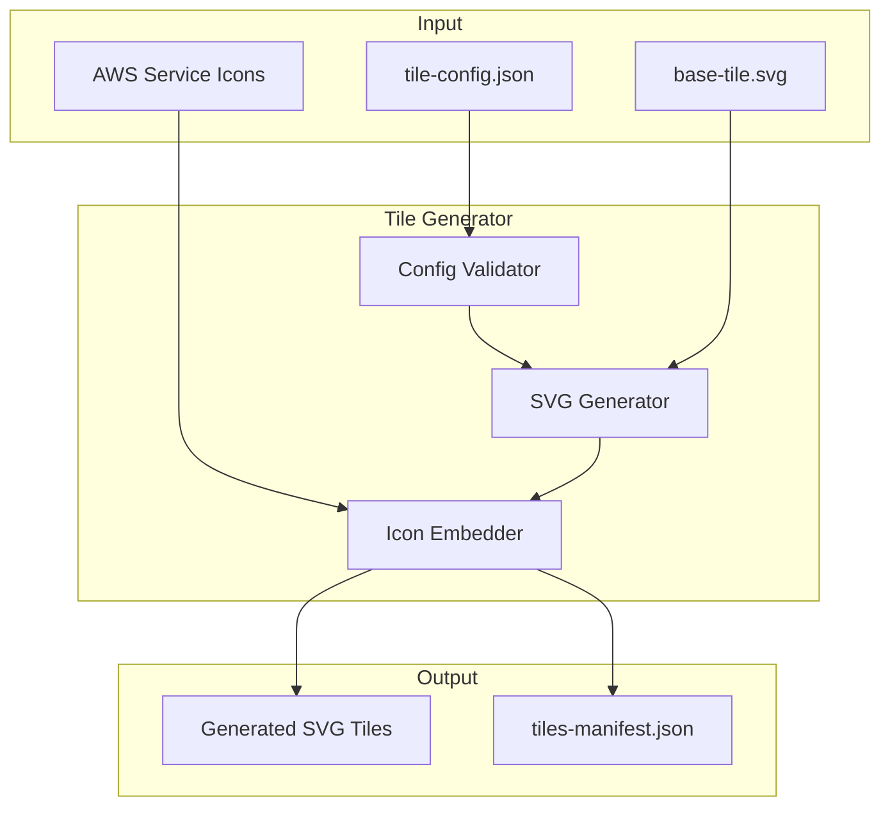

# 設計書

## 概要

AWS麻雀牌SVG生成システムは、JSON設定ファイルからAWSサービスをテーマにした麻雀牌のSVG画像を生成するシステムです。

本システムは以下の主要コンポーネントで構成されます：
- ベース牌テンプレート（SVG）
- 牌設定スキーマ（JSON Schema）
- SVG生成エンジン（TypeScript）

## アーキテクチャ



## コンポーネントとインターフェース

### 1. ベース牌テンプレート (Base Tile Template)

17mm × 24mm のSVGテンプレートで、以下の3つのプレースホルダーエリアを含みます：

```svg
<svg width="17mm" height="24mm" viewBox="0 0 68 96">
  <!-- 牌の背景（角丸・影付き） -->
  <rect id="tile-background" ... />
  
  <!-- 牌種類表示エリア（上部） -->
  <text id="tile-type-placeholder" ... />
  
  <!-- AWSアイコン表示エリア（中央） -->
  <g id="icon-placeholder" ... />
  
  <!-- サービス名表示エリア（下部） -->
  <text id="service-name-placeholder" ... />
</svg>
```

レイアウト仕様：
- 牌種類エリア: 上部 8px、フォントサイズ 8px
- アイコンエリア: 中央 40x40px（正方形）
- サービス名エリア: 下部 12px、フォントサイズ 6px

### 2. 牌設定スキーマ (Tile Config Schema)

```typescript
interface TileConfig {
  tiles: TileEntry[];
  metadata: {
    version: string;
    generatedAt?: string;
  };
}

interface TileEntry {
  // 牌の識別情報（MPSZ形式）
  id: string;                    // 例: "1m", "5p", "9s", "1z"
  type: TileType;                // 牌の種類
  number: number;                // 数牌: 1-9, 字牌: 1-7
  
  // AWSサービス情報
  awsService: {
    id: string;                  // 例: "ec2", "s3", "lambda"
    displayName: string;         // 例: "Amazon EC2", "Amazon S3"
    iconPath: string;            // アイコンファイルパス
  };
  
  // 表示設定（オプション）
  display?: {
    typeLabel?: string;          // カスタム牌種類ラベル
    iconScale?: number;          // アイコンスケール（デフォルト: 1.0）
  };
}

type TileType = 'm' | 'p' | 's' | 'z';
// m: 萬子(Man), p: 筒子(Pin), s: 索子(Sou), z: 字牌(Honor)
```

### 3. SVG生成エンジン (SVG Generator)

```typescript
interface TileGenerator {
  // 設定の検証
  validateConfig(config: TileConfig): ValidationResult;
  
  // 単一牌の生成
  generateTile(entry: TileEntry, template: string): string;
  
  // バッチ生成
  generateAll(config: TileConfig, outputDir: string): GenerationResult;
}

interface ValidationResult {
  valid: boolean;
  errors: ValidationError[];
}

interface ValidationError {
  field: string;
  message: string;
  tileId?: string;
}

interface GenerationResult {
  success: boolean;
  generated: number;
  failed: number;
  errors: GenerationError[];
  manifest: TileManifest;
}
```

## データモデル

### 牌の種類と数

| 種類 | 英語名 | 枚数 | 説明 |
|------|--------|------|------|
| 萬子 | man | 9種×4枚=36枚 | 1-9萬 |
| 筒子 | pin | 9種×4枚=36枚 | 1-9筒 |
| 索子 | sou | 9種×4枚=36枚 | 1-9索 |
| 字牌 | honor | 7種×4枚=28枚 | 東南西北白發中 |

合計: 34種類、136枚

### ファイル命名規則（MPSZ形式）

MPSZ形式は麻雀牌を表記する標準的な方法で、多くの麻雀ライブラリと互換性があります：

- **M** (Man/萬子): 1m, 2m, ... 9m
- **P** (Pin/筒子): 1p, 2p, ... 9p
- **S** (Sou/索子): 1s, 2s, ... 9s
- **Z** (字牌/Honor): 1z(東), 2z(南), 3z(西), 4z(北), 5z(白), 6z(發), 7z(中)

```
{number}{type}.svg

例:
- 1m.svg, 2m.svg, ... 9m.svg  (萬子)
- 1p.svg, 2p.svg, ... 9p.svg  (筒子)
- 1s.svg, 2s.svg, ... 9s.svg  (索子)
- 1z.svg (東), 2z.svg (南), 3z.svg (西), 4z.svg (北)
- 5z.svg (白), 6z.svg (發), 7z.svg (中)
```

### マニフェストファイル構造

```json
{
  "version": "1.0.0",
  "generatedAt": "2024-01-01T00:00:00Z",
  "tileCount": 34,
  "tiles": [
    {
      "id": "1m",
      "type": "m",
      "number": 1,
      "filePath": "tiles/1m.svg",
      "awsService": {
        "id": "ec2",
        "displayName": "Amazon EC2"
      }
    }
  ]
}
```

## 正確性プロパティ (Correctness Properties)

*プロパティとは、システムのすべての有効な実行において真であるべき特性や振る舞いです。プロパティは、人間が読める仕様と機械で検証可能な正確性保証の橋渡しをします。*

### Property 1: ベース牌の寸法

*For any* 生成されたベース牌SVG、幅は17mm、高さは24mmでなければならない。

**Validates: Requirements 1.1**

### Property 2: 有効な設定構造

*For any* 有効なTileConfig、すべてのエントリは以下を含まなければならない：
- 牌の種類（type）
- 番号（number）
- AWSサービス識別子（awsService.id）
- アイコンパス（awsService.iconPath）

**Validates: Requirements 2.2, 2.3, 2.4, 2.5**

### Property 3: 無効な設定の検証エラー

*For any* 必須フィールドが欠けているTileConfigエントリ、バリデーターは欠けているフィールドを特定するエラーを返さなければならない。

**Validates: Requirements 2.6**

### Property 4: 生成数の一致

*For any* 有効なTileConfig、生成されるSVGファイルの数は設定内のタイルエントリ数と等しくなければならない。

**Validates: Requirements 3.1**

### Property 5: 牌コンテンツの埋め込み

*For any* 生成された牌SVG、以下が含まれなければならない：
- 指定されたService_Iconのコンテンツ
- サービス名のテキスト

**Validates: Requirements 3.2, 3.3**

### Property 6: ファイル命名規則（MPSZ形式）

*For any* 生成された牌SVGファイル、ファイル名は `{number}{type}.svg` のMPSZ形式に従わなければならない（例: 1m.svg, 5p.svg, 7z.svg）。

**Validates: Requirements 3.4**

### Property 7: SVGラウンドトリップ

*For any* 生成されたSVGファイル、パースして再シリアライズした結果は元のSVGと等価でなければならない。

**Validates: Requirements 3.6**

### Property 8: 生成出力

*For any* 生成実行、以下が真でなければならない：
- すべてのSVGは指定された出力ディレクトリに配置される
- マニフェストファイルが生成され、すべての牌のメタデータを含む

**Validates: Requirements 4.1, 4.2**

### Property 9: 再生成時のファイル上書き

*For any* 既存の牌を再生成する場合、既存のファイルは新しいコンテンツで上書きされなければならない。

**Validates: Requirements 4.3**

### Property 10: バッチ生成レポート

*For any* バッチ生成の完了、結果は正確な生成数とエラー数を含まなければならない。

**Validates: Requirements 4.5**

## エラーハンドリング

### 設定検証エラー

| エラー種別 | 原因 | 対応 |
|-----------|------|------|
| MissingFieldError | 必須フィールドの欠落 | 欠落フィールド名を含むエラーメッセージを返す |
| InvalidTypeError | 不正な牌種類 | 有効な種類のリストを含むエラーを返す |
| InvalidNumberError | 範囲外の番号（1-9以外） | 有効な範囲を示すエラーを返す |
| DuplicateIdError | 重複する牌ID | 重複IDを示すエラーを返す |

### ファイル操作エラー

| エラー種別 | 原因 | 対応 |
|-----------|------|------|
| IconNotFoundError | アイコンファイルが見つからない | パスを含むエラーを返し、その牌をスキップ |
| OutputDirError | 出力ディレクトリへの書き込み失敗 | エラーを返し、生成を中止 |
| TemplateParseError | テンプレートSVGのパース失敗 | エラーを返し、生成を中止 |

## テスト戦略

### ユニットテスト

ユニットテストは特定の例、エッジケース、エラー条件を検証します：

1. **設定バリデーション**
   - 有効な設定の受け入れ
   - 各必須フィールド欠落時のエラー
   - 境界値（number: 0, 10など）

2. **SVG生成**
   - 単一牌の生成
   - アイコン埋め込み
   - テキスト埋め込み

3. **ファイル操作**
   - 出力ディレクトリ作成
   - ファイル上書き
   - マニフェスト生成

### プロパティベーステスト

プロパティベーステストは、ランダムに生成された入力に対して普遍的なプロパティを検証します。

**テストフレームワーク**: fast-check（TypeScript用）

**設定**:
- 各プロパティテストは最低100回のイテレーション
- 各テストは設計書のプロパティを参照するコメントを含む
- タグ形式: **Feature: aws-mahjong-tiles, Property {number}: {property_text}**

**実装するプロパティテスト**:

1. **Property 1**: ベース牌寸法テスト
2. **Property 2**: 有効設定構造テスト
3. **Property 3**: 無効設定検証テスト
4. **Property 4**: 生成数一致テスト
5. **Property 5**: コンテンツ埋め込みテスト
6. **Property 6**: ファイル命名規則テスト
7. **Property 7**: SVGラウンドトリップテスト
8. **Property 8**: 生成出力テスト
9. **Property 9**: ファイル上書きテスト
10. **Property 10**: バッチレポートテスト
