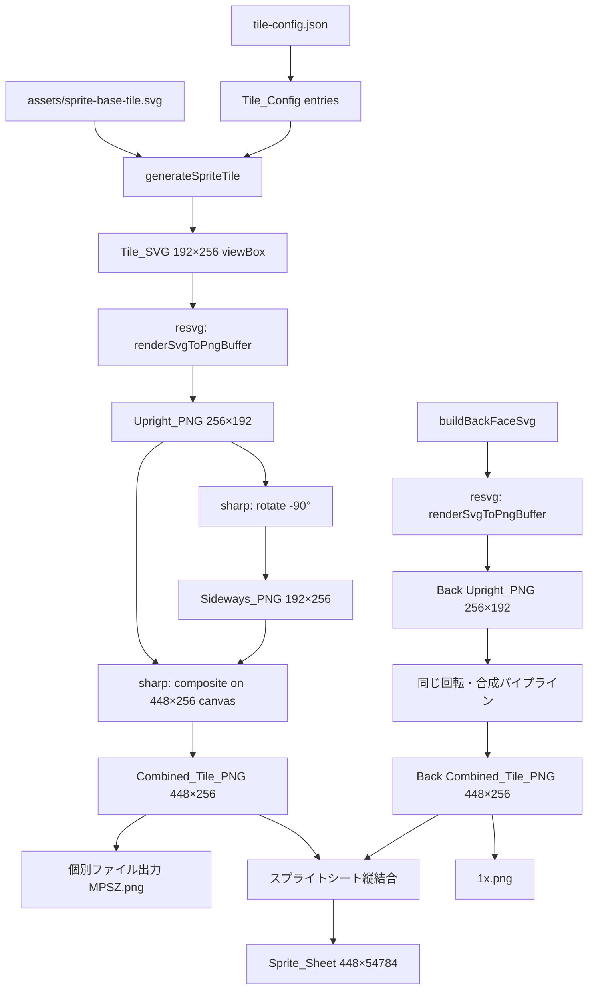

# Design Document

## Overview

riichi-advanced向けのスプライトシートPNGおよび個別牌PNG画像を生成するモジュール `src/riichiAdvancedSprite.ts` を新規作成する。既存のImageMagickベースのパイプラインを完全に排除し、`@resvg/resvg-js`（SVG→PNG変換）と `sharp`（画像回転・合成・縦結合）のみで全処理を行う。

### 生成フロー

1. `sprite-base-tile.svg` テンプレートにアイコンと牌種類ラベルを埋め込み → Tile_SVG（192×256 viewBox）
2. Tile_SVGをresvgで256×192ピクセルにレンダリング → Upright_PNG
3. Upright_PNGを反時計回り90°回転 → Sideways_PNG（192×256）
4. Upright_PNG（256×192、上詰め＋下部64px透明パディング）+ Sideways_PNG（192×256）を横結合 → Combined_Tile_PNG（448×256）
5. 全Combined_Tile_PNGを所定の行順序で縦結合 → Sprite_Sheet（448×54784、214行×256px/行）

### 主要な設計判断

- **ImageMagick完全排除**: 外部コマンド依存をなくし、CI/CD環境やコンテナでの実行を容易にする
- **sharp採用**: Node.jsネイティブの高性能画像処理ライブラリ。回転（`rotate`）、合成（`composite`）、リサイズ（`extend`）、縦結合をすべてサポート
- **resvg維持**: SVG→PNG変換は既存の `@resvg/resvg-js` をそのまま使用
- **sprite-base-tileテンプレート使用**: 既存の `generateSpriteTile()` 関数で192×256 viewBoxのSVGを生成し、resvgで256×192にレンダリング（横長フィット）

## Architecture



### モジュール構成

```
src/riichiAdvancedSprite.ts    (新規) メイン生成モジュール
  ├─ renderSvgToPngBuffer()      resvg SVG→PNG変換
  ├─ buildCombinedTilePng()      Upright + Sideways → Combined (sharp)
  ├─ buildReplacementRow()       1行分のCombined_Tile_PNG生成
  ├─ composeSpriteSheet()        全行を縦結合してスプライトシート生成 (sharp)
  ├─ buildRiichiAdvancedAwsSprite()  メインエントリポイント
  ├─ addTileFaceBackground()     牌表面背景追加（既存ロジック移植）
  ├─ buildBackFaceSvg()          裏面牌SVG生成
  ├─ readTileSvg()               マニフェストからSVG読み込み
  └─ readManifestEntries()       マニフェスト読み込み

src/riichiAdvancedSpriteCli.ts (新規) CLIエントリポイント
  └─ main()                      CLI引数パース・実行
```

### 依存ライブラリ

| ライブラリ | 用途 | 備考 |
|---|---|---|
| `@resvg/resvg-js` | SVG→PNG変換 | 既存依存。Tile_SVGを256×192 PNGにレンダリング |
| `sharp` | 画像回転・合成・縦結合 | **新規追加**。CCW90°回転、composite、vertical join |


## Components and Interfaces

### 定数定義

```typescript
// スプライトシート寸法
export const SPRITE_WIDTH = 448;           // Combined_Tile_PNG幅
export const SPRITE_ROW_HEIGHT = 256;      // 1行の高さ = Combined_Tile_PNG高さ
export const SPRITE_ROWS = 214;            // 総行数
export const SPRITE_HEIGHT = SPRITE_ROWS * SPRITE_ROW_HEIGHT; // 54784

// Upright_PNG寸法（resvgレンダリング結果）
export const UPRIGHT_TILE_WIDTH = 256;
export const UPRIGHT_TILE_HEIGHT = 192;

// Sideways_PNG寸法（Upright_PNGをCCW90°回転）
export const SIDEWAYS_TILE_WIDTH = 192;    // = UPRIGHT_TILE_HEIGHT
export const SIDEWAYS_TILE_HEIGHT = 256;   // = UPRIGHT_TILE_WIDTH

// パス定数
export const TILE_SVG_DIR = 'output';
export const TILE_MANIFEST_PATH = 'output/tiles-manifest.json';
export const RIICHI_ADVANCED_TILE_SPRITE_PATH = 'output/riichi-advanced-tiles.png';
export const STOCK_TILE_SPRITE_PATH = 'assets/stock-sprite.png'; // 参照用
```

### SpriteReplacement インターフェース

```typescript
export interface SpriteReplacement {
  rowIndex: number;
  spriteTileId: string;
  sourceTileId: string | null;
  kind: 'tile' | 'back' | 'transparent';
}
```

### RIICHI_ADVANCED_AWS_REPLACEMENTS

38エントリの配列。行0-36が牌（0m/0p/0sは`kind: 'transparent'`）、行44が裏面牌。

```typescript
export const RIICHI_ADVANCED_AWS_REPLACEMENTS: SpriteReplacement[] = [
  // 萬子 (rows 0-9)
  { rowIndex: 0,  spriteTileId: '0m', sourceTileId: null,  kind: 'transparent' },
  { rowIndex: 1,  spriteTileId: '1m', sourceTileId: '1m',  kind: 'tile' },
  // ... 2m-9m
  // 筒子 (rows 10-19)
  { rowIndex: 10, spriteTileId: '0p', sourceTileId: null,  kind: 'transparent' },
  { rowIndex: 11, spriteTileId: '1p', sourceTileId: '1p',  kind: 'tile' },
  // ... 2p-9p
  // 索子 (rows 20-29)
  { rowIndex: 20, spriteTileId: '0s', sourceTileId: null,  kind: 'transparent' },
  { rowIndex: 21, spriteTileId: '1s', sourceTileId: '1s',  kind: 'tile' },
  // ... 2s-9s
  // 字牌 (rows 30-36)
  { rowIndex: 30, spriteTileId: '1z', sourceTileId: '1z',  kind: 'tile' },
  // ... 2z-7z
  // 裏面牌 (row 44)
  { rowIndex: 44, spriteTileId: '1x', sourceTileId: null,  kind: 'back' },
];
```

### RED_DORA_MAPPING

赤ドラ個別ファイル生成用マッピング。スプライトシートでは透明行だが、個別ファイルとしては5番牌のソースSVGから生成する。

```typescript
export const RED_DORA_MAPPING: Array<{ id: string; sourceTileId: string }> = [
  { id: '0m', sourceTileId: '5m' },
  { id: '0p', sourceTileId: '5p' },
  { id: '0s', sourceTileId: '5s' },
];
```

### BuildRiichiAdvancedAwsSpriteOptions

```typescript
export interface BuildRiichiAdvancedAwsSpriteOptions {
  outputPath?: string;           // スプライトシート出力パス（デフォルト: RIICHI_ADVANCED_TILE_SPRITE_PATH）
  individualOutputDir?: string;  // 個別PNG出力ディレクトリ（指定時のみ出力）
  manifestPath?: string;         // マニフェストJSONパス
  svgDir?: string;               // SVGファイルディレクトリ
}
```

### 主要関数

#### renderSvgToPngBuffer(svgString, options)

resvgを使用してSVG文字列をPNGバッファに変換する。`fitTo: { mode: 'width', value: 256 }` を指定し、192×256 viewBoxのSVGを256×192ピクセルのPNGにレンダリングする。

```typescript
export async function renderSvgToPngBuffer(
  svgString: string,
  options?: { width?: number; height?: number }
): Promise<Buffer>;
```

#### buildCombinedTilePng(uprightPngBuffer)

sharpを使用して、Upright_PNG（256×192）からCombined_Tile_PNG（448×256）を生成する。

処理手順:
1. Upright_PNGをsharpで読み込み
2. `sharp.rotate(-90)` で反時計回り90°回転 → Sideways_PNG（192×256）
3. 448×256の透明キャンバスを作成
4. Upright_PNG（256×192）を左上 (0, 0) に合成（下部64pxは透明パディング）
5. Sideways_PNG（192×256）を右側 (256, 0) に合成
6. PNGバッファとして返す

```typescript
export async function buildCombinedTilePng(uprightPngBuffer: Buffer): Promise<Buffer>;
```

#### buildReplacementRow(replacement, manifestEntries, svgDir)

1つのSpriteReplacementエントリからCombined_Tile_PNGバッファを生成する。

- `kind: 'tile'`: SVG読み込み → `addTileFaceBackground` → `renderSvgToPngBuffer` → `buildCombinedTilePng`
- `kind: 'back'`: `buildBackFaceSvg` → `renderSvgToPngBuffer` → `buildCombinedTilePng`
- `kind: 'transparent'`: sharpで448×256の透明PNGバッファを生成

```typescript
export async function buildReplacementRow(
  replacement: SpriteReplacement,
  manifestEntries: Map<string, ManifestEntry>,
  svgDir: string
): Promise<Buffer>;
```

#### composeSpriteSheet(rowBuffers)

全行のPNGバッファを受け取り、sharpで縦結合してスプライトシートを生成する。

- 214行分の448×256バッファを用意（未指定行は透明）
- `sharp` の `composite` で各行を `top: rowIndex * 256` に配置
- 最終的に448×54784のPNGバッファを返す

```typescript
export async function composeSpriteSheet(
  rowBuffers: Map<number, Buffer>
): Promise<Buffer>;
```

#### buildRiichiAdvancedAwsSprite(options)

メインエントリポイント。全処理を統括する。

1. マニフェスト読み込み
2. `RIICHI_ADVANCED_AWS_REPLACEMENTS` の各エントリに対して `buildReplacementRow` を実行
3. `individualOutputDir` 指定時: 各行PNGを個別ファイルとして保存
4. `individualOutputDir` 指定時: `RED_DORA_MAPPING` に基づいて赤ドラ個別ファイルを生成
5. `composeSpriteSheet` でスプライトシートを生成・保存

```typescript
export async function buildRiichiAdvancedAwsSprite(
  options?: BuildRiichiAdvancedAwsSpriteOptions
): Promise<void>;
```

### SVG加工関数（既存ロジック移植）

#### addTileFaceBackground(rawSvg)

元の68×96 viewBoxのSVGに牌表面背景（グラデーション、ボーダー、シャドウ、ハイライト）を追加する。viewBoxは68×96のまま保持し、192×256へのスケーリングはresvgレンダリング時に行う。

#### stripServiceNameFromTileSvg(svg)

SVGから `id="service-name-placeholder"` のtext要素を除去する。牌種類ラベルとアイコンは保持する。冪等性を持つ（2回適用しても結果は同じ）。

#### buildBackFaceSvg()

裏面牌のSVGを生成する。既存のデザインを使用。

#### readTileSvg(manifestEntries, svgDir, tileId)

マニフェストからtileIdに対応するSVGファイルを読み込む。`{tileId}.svg` ファイル名を優先して解決する。

#### readManifestEntries(manifestPath)

マニフェストJSONを読み込み、`Map<string, ManifestEntry>` として返す。


## Data Models

### Tile_Config（tile-config.json）

既存の `TileConfig` 型をそのまま使用。各エントリは `id`（MPSZ形式）、`type`、`number`、`awsService`（アイコンパス含む）を持つ。

### ManifestEntry

```typescript
interface ManifestEntry {
  id: string;
  filePath?: string;
}
```

### スプライトシート行配置

| 行範囲 | 内容 | 備考 |
|---|---|---|
| 0 | 0m（透明） | 個別ファイルは赤ドラとして生成 |
| 1-9 | 1m-9m | 通常牌 |
| 10 | 0p（透明） | 個別ファイルは赤ドラとして生成 |
| 11-19 | 1p-9p | 通常牌 |
| 20 | 0s（透明） | 個別ファイルは赤ドラとして生成 |
| 21-29 | 1s-9s | 通常牌 |
| 30-36 | 1z-7z | 字牌 |
| 37-43 | 透明 | ギャップ行 |
| 44 | 1x（裏面牌） | Back_Face_Tile |
| 45-213 | 透明 | 残余行 |

### Combined_Tile_PNG レイアウト（448×256）

```
┌─────────────────────┬──────────────┐
│  Upright_PNG        │ Sideways_PNG │
│  256×192            │ 192×256      │
│  (top-aligned)      │              │
│                     │              │
│                     │              │
├─────────────────────┤              │
│  透明パディング      │              │
│  256×64             │              │
└─────────────────────┴──────────────┘
 ← 256px →             ← 192px →
 ←────────── 448px ──────────────→
                                ↕ 256px
```


## Correctness Properties

*プロパティとは、システムの全ての有効な実行において成立すべき特性や振る舞いのことである。人間が読める仕様と機械的に検証可能な正しさの保証を橋渡しする形式的な記述として機能する。*

### Property 1: スプライトシート寸法の不変条件

*For all* ビルド実行において、出力スプライトシートPNGの寸法は幅448ピクセル、高さ54784ピクセル（214行 × 256ピクセル/行）でなければならない。

**Validates: Requirements 6.1, 6.7**

### Property 2: 赤ドラ位置の透明行

*For all* スプライトシートにおいて、行0（0m）、行10（0p）、行20（0s）は完全透明（全ピクセルのアルファ値 = 0）でなければならない。

**Validates: Requirements 4.4, 6.4**

### Property 3: 個別PNG寸法の不変条件

*For all* 生成された個別牌PNGファイルにおいて、画像寸法は448×256ピクセルでなければならない。

**Validates: Requirements 3.2, 5.1**

### Property 4: 赤ドラ個別ファイルの存在と寸法

*For all* 赤ドラID（0m, 0p, 0s）において、`individualOutputDir` に対応するPNGファイルが存在し、ファイルサイズが0より大きく、寸法が448×256ピクセルでなければならない。

**Validates: Requirements 4.1, 4.2, 4.3**

### Property 5: 裏面牌行の配置とギャップ行の透明性

*For all* スプライトシートにおいて、行44は非透明（裏面牌が配置されている）であり、行37-43は完全透明でなければならない。

**Validates: Requirements 6.2, 6.5**

### Property 6: 末尾透明行

*For all* スプライトシートにおいて、行45から行213までは完全透明でなければならない。

**Validates: Requirements 6.6**

### Property 7: Tile_SVGテンプレート要素の保持

*For all* 有効なTile_Configエントリにおいて、`generateSpriteTile` で生成されたTile_SVGは viewBox "0 0 192 256" を持ち、22px角丸クリッピングパス、グラデーション背景（`aws-tile-front-gradient`）、ボーダー装飾、シャドウ要素、ハイライト要素を含まなければならない。

**Validates: Requirements 1.2, 1.3, 1.4, 9.2**

### Property 8: サービス名除去の冪等性

*For all* Tile_SVGにおいて、`stripServiceNameFromTileSvg` を2回適用した結果は1回適用した結果と同一でなければならない。

**Validates: Requirements 9.3**

### Property 9: Upright_PNG寸法の不変条件

*For all* 有効なTile_Configエントリにおいて、Tile_SVGを生成しresvgでレンダリングした結果のUpright_PNGは幅256ピクセル、高さ192ピクセルでなければならない。

**Validates: Requirements 2.1, 2.3, 9.1**

### Property 10: Combined_Tile_PNGの合成レイアウト

*For all* 生成されたCombined_Tile_PNG（448×256）において、左下領域（x: 0-255, y: 192-255）の64ピクセル高の帯は完全透明でなければならない（Upright_PNGの下部パディング）。

**Validates: Requirements 3.1, 3.2**

### Property 11: 行数の不変条件

*For all* `RIICHI_ADVANCED_AWS_REPLACEMENTS` 配列において、総エントリ数は38であり、非透明エントリ（`kind !== 'transparent'`）は35、透明エントリは3（0m, 0p, 0s）でなければならない。

**Validates: Requirements 6.2**

### Property 12: 牌行の非透明性

*For all* `RIICHI_ADVANCED_AWS_REPLACEMENTS` の `kind === 'tile'` または `kind === 'back'` エントリにおいて、スプライトシートの対応する行は非透明（アルファチャネル平均 > 0）でなければならない。

**Validates: Requirements 6.2, 6.3**


## Error Handling

### SVG読み込みエラー

- マニフェストに存在しないtileIdが指定された場合、エラーメッセージをログに出力し、そのタイルをスキップして処理を継続する
- SVGファイルが読み込めない場合も同様にスキップ

### PNG変換エラー

- resvgでのレンダリングに失敗した場合、エラーをログに出力してスキップ
- sharpでの画像処理（回転・合成・縦結合）に失敗した場合、エラーをログに出力してスキップ

### ファイル出力エラー

- 出力ディレクトリが作成できない場合、プロセスを中断（致命的エラー）
- 個別ファイルの書き込みに失敗した場合、エラーをログに出力して処理を継続

### CLIエラーハンドリング

- 1つ以上のタイル生成が失敗した場合、全タイル処理完了後に非ゼロ終了コードで終了
- 全タイル成功時はサマリーを表示して終了コード0で終了

## Testing Strategy

### テストフレームワーク

- **ユニットテスト / プロパティテスト**: Vitest + fast-check
- **画像検証**: sharp（`sharp(buffer).metadata()` で寸法取得、`sharp(buffer).raw()` でピクセルデータ取得）

### ImageMagick依存の排除（テスト側）

既存テストはImageMagickの `magick identify`、`magick compare`、`magick crop` を使用しているが、新しいテストではsharpのみを使用する。これにより、テスト実行環境にもImageMagickが不要になる。

- 寸法取得: `sharp(buffer).metadata()` → `{ width, height }`
- 行切り出し: `sharp(buffer).extract({ left: 0, top: rowIndex * 256, width: 448, height: 256 })`
- アルファチャネル検証: `sharp(buffer).raw().toBuffer()` → RGBAピクセルデータのアルファ値を検査

### デュアルテストアプローチ

#### ユニットテスト

- 特定の入力に対する具体的な出力の検証
- ディレクトリ作成・ファイル上書きなどのエッジケース
- CLIの引数パースと出力メッセージ
- エラーハンドリングの動作確認

#### プロパティベーステスト（fast-check）

- 各Correctness Propertyに対応する1つのプロパティテストを実装
- 最低100イテレーション/テスト
- 各テストにはデザインドキュメントのプロパティ番号をタグとしてコメントに記載
- タグ形式: **Feature: riichi-sprite-png, Property {number}: {property_text}**

### テスト構成

```
tests/riichiAdvancedSprite.test.ts
  ├─ describe('buildRiichiAdvancedAwsSprite')     基本動作テスト
  ├─ describe('Property 1: スプライトシート寸法')   448×54784検証
  ├─ describe('Property 2: 透明行')               行0,10,20の透明性
  ├─ describe('Property 3: 個別PNG寸法')           448×256検証
  ├─ describe('Property 4: 赤ドラファイル')         0m/0p/0s存在・寸法
  ├─ describe('Property 5: 裏面牌行配置')          行44非透明、行37-43透明
  ├─ describe('Property 6: 末尾透明行')            行45-213透明
  ├─ describe('Property 7: SVGテンプレート要素')    viewBox・装飾要素保持
  ├─ describe('Property 8: サービス名除去冪等性')   strip(strip(x)) === strip(x)
  ├─ describe('Property 9: Upright_PNG寸法')       256×192検証
  ├─ describe('Property 10: 合成レイアウト')        左下64px透明パディング
  ├─ describe('Property 11: 行数不変条件')          38エントリ、35非透明+3透明
  └─ describe('Property 12: 牌行非透明性')          tile/back行のアルファ>0
```

### プロパティテスト設定

- ライブラリ: `fast-check` (既存依存)
- 最低イテレーション: 100回（`{ numRuns: 100 }`）
- 非同期プロパティ: `fc.asyncProperty` を使用（ファイルI/O・画像処理を含むため）
- 入力生成: `fc.constantFrom(...RIICHI_ADVANCED_AWS_REPLACEMENTS)` で全エントリを網羅

## File Changes

### New Files

1. `src/riichiAdvancedSprite.ts` - メイン生成モジュール（全関数・定数・型定義）
2. `src/riichiAdvancedSpriteCli.ts` - CLIエントリポイント

### Modified Files

1. `package.json` - `sharp` を dependencies に追加、`riichi-advanced:tiles` スクリプトを更新
2. `tests/riichiAdvancedSprite.test.ts` - ImageMagick依存を排除し、sharp ベースのテストに書き換え

### 既存ファイルからの移植

以下の関数は既存の `src/generator.ts` および `src/template.ts` のロジックを `src/riichiAdvancedSprite.ts` に移植・統合する:

- `generateSpriteTile()` - `generator.ts` から
- `addTileFaceBackground()` - 既存ロジック
- `stripServiceNameFromTileSvg()` - 既存ロジック
- `buildBackFaceSvg()` - 既存ロジック
- `SPRITE_BASE_TILE_TEMPLATE` - `template.ts` から
- `replaceSpriteAllPlaceholders()` 関連 - `template.ts` から
